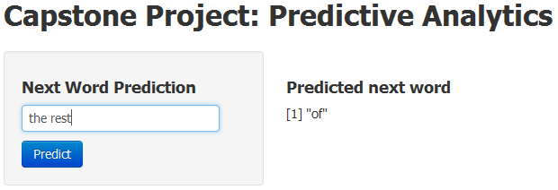

Next Word Predictor 
========================================================
author: M. Taufeeq 
date: Dec, 2014

Preprocessing
========================================================

**Sample data** 

- 2% blogs text
- 25% news text
- 25% twitter text

**Creating 4-gram tokens from text corpus**

- Detecting sentences
- Profanity filtering such as repalcement of the words, removing numbers and punctuation, stripping white space
- Building Document term matrix of 4-gram and corresponding frequency

Markov Chain
========================================================

- retokenized the 4-gram to unigram to build training data
- use **Markov Chain** algorithm for building predictive model

Explanation
========================================================

Snap shot
=======================================================

In order to **predict next word** type a pharse in the given text box and press enter. A snapshot of the app is given below:

