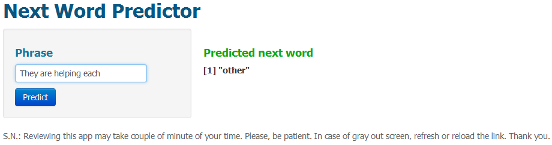

Next Word Predictor 
========================================================
author: M Taufeeq 
date: Dec, 2014

========================================================
## **Goal of the Capstone Project**
Build a predictive analytics app that can take a phrase (multiple words) as input and predicts the next word using prediction algorithm which is trained on the provided data

## **Tasks**
- Preprocess the data
- Build predictive model
- Build shiny app

## **Sample data**

- 2% blogs text
- 5% news text
- 15% twitter text

========================================================

## **Preprocessing**  

- Clean the data and filter out profane data
- Tokenize the data 
- Build Document term matrix of 4-gram and corresponding frequency
- Explore the data

## **Prediction approach**

- Replicate the 4-gram based on the corresponding rescaled frequency 
- Build sequence vector of the replicated 4-gram and tokenize the vector
- Implement **Markov Chain** algorithm for building prediction model

========================================================

## **Description of the prediction model: Markov Chain**
- compute the probability of a word looking at the probability of the previous word.

- fits the underlying Markov chain distribution using Maximum Likelihood Estimation **MLE**

- Build a transition matrix for each word of the training set

- Build the prediction function to predict the next word using the model 

- Default and out of vocabulary prediction : **the** 

=======================================================
## **App functionality**
This app has the following capabilities:
- Text input for input phrase
- Displays the predicted next word  

In order to **predict next word**, type a pharse in the given text box and then, click the **Predict** button. App will visualize the **predicted next word** in right side of the interface. A snapshot of the app is given below:

