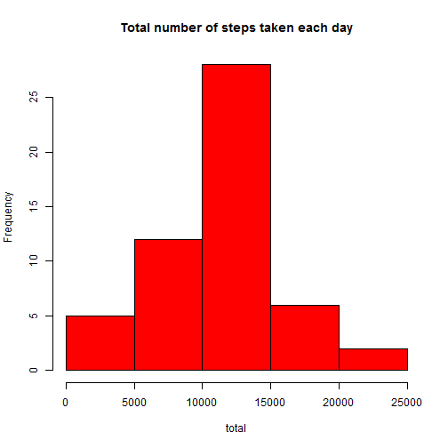
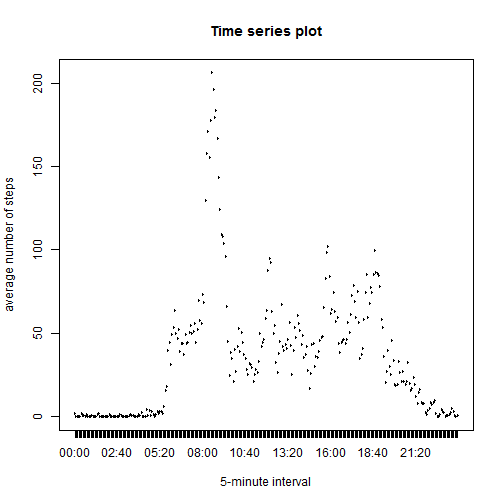
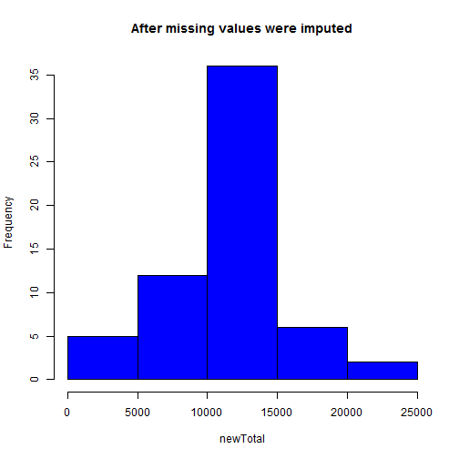
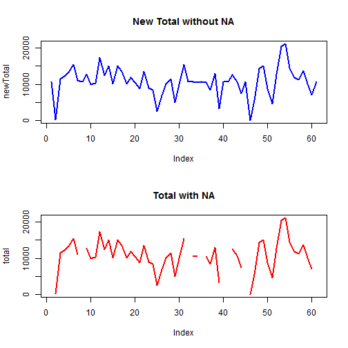
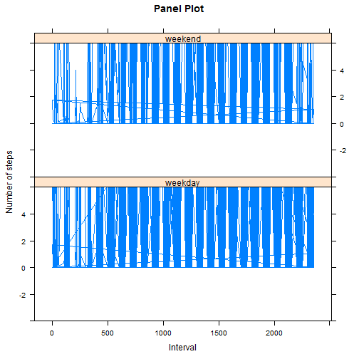

Loading and preprocessing the data
==================================

Show any code that is needed to

1. Load the data (i.e. read.csv())

2. Process/transform the data (if necessary) into a format suitable for your analysis

```r
setwd("F:/Data Science/5. Reproducible Research/Week2/Project1")
getwd()
```

```
## [1] "F:/Data Science/5. Reproducible Research/Week2/Project1"
```

```r

# read the dataset
data <- read.csv("activity.csv")
dim(data)
```

```
## [1] 17568     3
```

```r
data[1:10, 1:3]
```

```
##    steps       date interval
## 1     NA 2012-10-01        0
## 2     NA 2012-10-01        5
## 3     NA 2012-10-01       10
## 4     NA 2012-10-01       15
## 5     NA 2012-10-01       20
## 6     NA 2012-10-01       25
## 7     NA 2012-10-01       30
## 8     NA 2012-10-01       35
## 9     NA 2012-10-01       40
## 10    NA 2012-10-01       45
```

```r
summary(data)
```

```
##      steps               date          interval   
##  Min.   :  0.0   2012-10-01:  288   Min.   :   0  
##  1st Qu.:  0.0   2012-10-02:  288   1st Qu.: 589  
##  Median :  0.0   2012-10-03:  288   Median :1178  
##  Mean   : 37.4   2012-10-04:  288   Mean   :1178  
##  3rd Qu.: 12.0   2012-10-05:  288   3rd Qu.:1766  
##  Max.   :806.0   2012-10-06:  288   Max.   :2355  
##  NA's   :2304    (Other)   :15840
```

```r

dataFrame <- data.frame(data$steps, data$date, data$interval)
dim(dataFrame)
```

```
## [1] 17568     3
```

```r
dataFrame[1:10, 1:3]
```

```
##    data.steps  data.date data.interval
## 1          NA 2012-10-01             0
## 2          NA 2012-10-01             5
## 3          NA 2012-10-01            10
## 4          NA 2012-10-01            15
## 5          NA 2012-10-01            20
## 6          NA 2012-10-01            25
## 7          NA 2012-10-01            30
## 8          NA 2012-10-01            35
## 9          NA 2012-10-01            40
## 10         NA 2012-10-01            45
```


What is mean total number of steps taken per day?
=================================================

For this part of the assignment, you can ignore the missing values in the dataset

1. Make a histogram of the total number of steps taken each day

2. Calculate and report the mean and median total number of steps taken per day


```r
total <- tapply(dataFrame$data.steps, dataFrame$data.date, sum)
total
```

```
## 2012-10-01 2012-10-02 2012-10-03 2012-10-04 2012-10-05 2012-10-06 
##         NA        126      11352      12116      13294      15420 
## 2012-10-07 2012-10-08 2012-10-09 2012-10-10 2012-10-11 2012-10-12 
##      11015         NA      12811       9900      10304      17382 
## 2012-10-13 2012-10-14 2012-10-15 2012-10-16 2012-10-17 2012-10-18 
##      12426      15098      10139      15084      13452      10056 
## 2012-10-19 2012-10-20 2012-10-21 2012-10-22 2012-10-23 2012-10-24 
##      11829      10395       8821      13460       8918       8355 
## 2012-10-25 2012-10-26 2012-10-27 2012-10-28 2012-10-29 2012-10-30 
##       2492       6778      10119      11458       5018       9819 
## 2012-10-31 2012-11-01 2012-11-02 2012-11-03 2012-11-04 2012-11-05 
##      15414         NA      10600      10571         NA      10439 
## 2012-11-06 2012-11-07 2012-11-08 2012-11-09 2012-11-10 2012-11-11 
##       8334      12883       3219         NA         NA      12608 
## 2012-11-12 2012-11-13 2012-11-14 2012-11-15 2012-11-16 2012-11-17 
##      10765       7336         NA         41       5441      14339 
## 2012-11-18 2012-11-19 2012-11-20 2012-11-21 2012-11-22 2012-11-23 
##      15110       8841       4472      12787      20427      21194 
## 2012-11-24 2012-11-25 2012-11-26 2012-11-27 2012-11-28 2012-11-29 
##      14478      11834      11162      13646      10183       7047 
## 2012-11-30 
##         NA
```

```r
dim(total)
```

```
## [1] 61
```

```r
hist(total, col = "red", main = "Total number of steps taken each day")
```

 

```r

# report mean
mean <- tapply(dataFrame$data.steps, dataFrame$data.date, mean)
mean
```

```
## 2012-10-01 2012-10-02 2012-10-03 2012-10-04 2012-10-05 2012-10-06 
##         NA     0.4375    39.4167    42.0694    46.1597    53.5417 
## 2012-10-07 2012-10-08 2012-10-09 2012-10-10 2012-10-11 2012-10-12 
##    38.2465         NA    44.4826    34.3750    35.7778    60.3542 
## 2012-10-13 2012-10-14 2012-10-15 2012-10-16 2012-10-17 2012-10-18 
##    43.1458    52.4236    35.2049    52.3750    46.7083    34.9167 
## 2012-10-19 2012-10-20 2012-10-21 2012-10-22 2012-10-23 2012-10-24 
##    41.0729    36.0938    30.6285    46.7361    30.9653    29.0104 
## 2012-10-25 2012-10-26 2012-10-27 2012-10-28 2012-10-29 2012-10-30 
##     8.6528    23.5347    35.1354    39.7847    17.4236    34.0938 
## 2012-10-31 2012-11-01 2012-11-02 2012-11-03 2012-11-04 2012-11-05 
##    53.5208         NA    36.8056    36.7049         NA    36.2465 
## 2012-11-06 2012-11-07 2012-11-08 2012-11-09 2012-11-10 2012-11-11 
##    28.9375    44.7326    11.1771         NA         NA    43.7778 
## 2012-11-12 2012-11-13 2012-11-14 2012-11-15 2012-11-16 2012-11-17 
##    37.3785    25.4722         NA     0.1424    18.8924    49.7882 
## 2012-11-18 2012-11-19 2012-11-20 2012-11-21 2012-11-22 2012-11-23 
##    52.4653    30.6979    15.5278    44.3993    70.9271    73.5903 
## 2012-11-24 2012-11-25 2012-11-26 2012-11-27 2012-11-28 2012-11-29 
##    50.2708    41.0903    38.7569    47.3819    35.3576    24.4688 
## 2012-11-30 
##         NA
```

```r

# report median
median <- tapply(dataFrame$data.steps, dataFrame$data.date, median)
median
```

```
## 2012-10-01 2012-10-02 2012-10-03 2012-10-04 2012-10-05 2012-10-06 
##         NA          0          0          0          0          0 
## 2012-10-07 2012-10-08 2012-10-09 2012-10-10 2012-10-11 2012-10-12 
##          0         NA          0          0          0          0 
## 2012-10-13 2012-10-14 2012-10-15 2012-10-16 2012-10-17 2012-10-18 
##          0          0          0          0          0          0 
## 2012-10-19 2012-10-20 2012-10-21 2012-10-22 2012-10-23 2012-10-24 
##          0          0          0          0          0          0 
## 2012-10-25 2012-10-26 2012-10-27 2012-10-28 2012-10-29 2012-10-30 
##          0          0          0          0          0          0 
## 2012-10-31 2012-11-01 2012-11-02 2012-11-03 2012-11-04 2012-11-05 
##          0         NA          0          0         NA          0 
## 2012-11-06 2012-11-07 2012-11-08 2012-11-09 2012-11-10 2012-11-11 
##          0          0          0         NA         NA          0 
## 2012-11-12 2012-11-13 2012-11-14 2012-11-15 2012-11-16 2012-11-17 
##          0          0         NA          0          0          0 
## 2012-11-18 2012-11-19 2012-11-20 2012-11-21 2012-11-22 2012-11-23 
##          0          0          0          0          0          0 
## 2012-11-24 2012-11-25 2012-11-26 2012-11-27 2012-11-28 2012-11-29 
##          0          0          0          0          0          0 
## 2012-11-30 
##         NA
```


What is the average daily activity pattern?
===========================================

1. Make a time series plot (i.e. type = "l") of the 5-minute interval (x-axis) and the average number of steps taken, averaged across all days (y-axis)

2. Which 5-minute interval, on average across all the days in the dataset, contains the maximum number of steps?


```r
time <- as.factor(sprintf("%02d:%02d", data$interval%/%100, data$interval%%100))
df <- cbind(data, time)
dim(df)
```

```
## [1] 17568     4
```

```r
res <- tapply(df$steps, df$time, na.rm = T, mean)
dim(res)
```

```
## [1] 288
```

```r

# time series plot
minuteInterval <- unique(df$time)
avgSteps <- as.numeric(as.character(res))
plot(minuteInterval, avgSteps, type = "l", xlab = "5-minute interval", ylab = "average number of steps", 
    main = "Time series plot")
```

 

```r

# report maximum number of steps
which.max(res)
```

```
## 08:35 
##   104
```


Imputing missing values
=======================

Note that there are a number of days/intervals where there are missing values (coded as NA). The presence of missing days may introduce bias into some calculations or summaries of the data.

1. Calculate and report the total number of missing values in the dataset (i.e. the total number of rows with NAs)

2. Devise a strategy for filling in all of the missing values in the dataset. The strategy does not need to be sophisticated. For example, you could use the mean/median for that day, or the mean for that 5-minute interval, etc.

3. Create a new dataset that is equal to the original dataset but with the missing data filled in.

4. Make a histogram of the total number of steps taken each day and Calculate and report the mean and median total number of steps taken per day. Do these values differ from the estimates from the first part of the assignment? What is the impact of imputing missing data on the estimates of the total daily number of steps?


```r
# count the number of NA
totalNA <- sum(is.na(dataFrame))
totalNA
```

```
## [1] 2304
```

```r

dataFrame[, 1] <- as.numeric(as.character(dataFrame[, 1]))
mn <- mean(dataFrame[, 1], na.rm = T)

# filling up the missing values of the dataset with avgSteps
dataFrame[is.na(dataFrame)] = avgSteps

dim(dataFrame)
```

```
## [1] 17568     3
```

```r
dataFrame[90:100, 1:3]
```

```
##     data.steps  data.date data.interval
## 90       50.98 2012-10-01           725
## 91       55.68 2012-10-01           730
## 92       44.32 2012-10-01           735
## 93       52.26 2012-10-01           740
## 94       69.55 2012-10-01           745
## 95       57.85 2012-10-01           750
## 96       56.15 2012-10-01           755
## 97       73.38 2012-10-01           800
## 98       68.21 2012-10-01           805
## 99      129.43 2012-10-01           810
## 100     157.53 2012-10-01           815
```

```r

## analyze the impact of imputing missing value total after replacing NA
newTotal <- tapply(dataFrame$data.steps, dataFrame$data.date, na.rm = T, sum)
newTotal
```

```
## 2012-10-01 2012-10-02 2012-10-03 2012-10-04 2012-10-05 2012-10-06 
##      10766        126      11352      12116      13294      15420 
## 2012-10-07 2012-10-08 2012-10-09 2012-10-10 2012-10-11 2012-10-12 
##      11015      10766      12811       9900      10304      17382 
## 2012-10-13 2012-10-14 2012-10-15 2012-10-16 2012-10-17 2012-10-18 
##      12426      15098      10139      15084      13452      10056 
## 2012-10-19 2012-10-20 2012-10-21 2012-10-22 2012-10-23 2012-10-24 
##      11829      10395       8821      13460       8918       8355 
## 2012-10-25 2012-10-26 2012-10-27 2012-10-28 2012-10-29 2012-10-30 
##       2492       6778      10119      11458       5018       9819 
## 2012-10-31 2012-11-01 2012-11-02 2012-11-03 2012-11-04 2012-11-05 
##      15414      10766      10600      10571      10766      10439 
## 2012-11-06 2012-11-07 2012-11-08 2012-11-09 2012-11-10 2012-11-11 
##       8334      12883       3219      10766      10766      12608 
## 2012-11-12 2012-11-13 2012-11-14 2012-11-15 2012-11-16 2012-11-17 
##      10765       7336      10766         41       5441      14339 
## 2012-11-18 2012-11-19 2012-11-20 2012-11-21 2012-11-22 2012-11-23 
##      15110       8841       4472      12787      20427      21194 
## 2012-11-24 2012-11-25 2012-11-26 2012-11-27 2012-11-28 2012-11-29 
##      14478      11834      11162      13646      10183       7047 
## 2012-11-30 
##      10766
```

```r
hist(newTotal, col = "blue", main = "After missing values were imputed")
```

 

```r

# total with NA
total
```

```
## 2012-10-01 2012-10-02 2012-10-03 2012-10-04 2012-10-05 2012-10-06 
##         NA        126      11352      12116      13294      15420 
## 2012-10-07 2012-10-08 2012-10-09 2012-10-10 2012-10-11 2012-10-12 
##      11015         NA      12811       9900      10304      17382 
## 2012-10-13 2012-10-14 2012-10-15 2012-10-16 2012-10-17 2012-10-18 
##      12426      15098      10139      15084      13452      10056 
## 2012-10-19 2012-10-20 2012-10-21 2012-10-22 2012-10-23 2012-10-24 
##      11829      10395       8821      13460       8918       8355 
## 2012-10-25 2012-10-26 2012-10-27 2012-10-28 2012-10-29 2012-10-30 
##       2492       6778      10119      11458       5018       9819 
## 2012-10-31 2012-11-01 2012-11-02 2012-11-03 2012-11-04 2012-11-05 
##      15414         NA      10600      10571         NA      10439 
## 2012-11-06 2012-11-07 2012-11-08 2012-11-09 2012-11-10 2012-11-11 
##       8334      12883       3219         NA         NA      12608 
## 2012-11-12 2012-11-13 2012-11-14 2012-11-15 2012-11-16 2012-11-17 
##      10765       7336         NA         41       5441      14339 
## 2012-11-18 2012-11-19 2012-11-20 2012-11-21 2012-11-22 2012-11-23 
##      15110       8841       4472      12787      20427      21194 
## 2012-11-24 2012-11-25 2012-11-26 2012-11-27 2012-11-28 2012-11-29 
##      14478      11834      11162      13646      10183       7047 
## 2012-11-30 
##         NA
```

```r
hist(total, col = "red", main = "Total with NA")
```

 

```r

# compare the dataset with NA vs without NA
par(mfrow = c(2, 1))
plot(newTotal, col = "blue", type = "l", lwd = 2, main = "New Total without NA")
plot(total, col = "red", type = "l", lwd = 2, main = "Total with NA")
```

 

```r

newMean <- tapply(dataFrame$data.steps, dataFrame$data.date, mean)
# mean after replacing NA
newMean
```

```
## 2012-10-01 2012-10-02 2012-10-03 2012-10-04 2012-10-05 2012-10-06 
##    37.3826     0.4375    39.4167    42.0694    46.1597    53.5417 
## 2012-10-07 2012-10-08 2012-10-09 2012-10-10 2012-10-11 2012-10-12 
##    38.2465    37.3826    44.4826    34.3750    35.7778    60.3542 
## 2012-10-13 2012-10-14 2012-10-15 2012-10-16 2012-10-17 2012-10-18 
##    43.1458    52.4236    35.2049    52.3750    46.7083    34.9167 
## 2012-10-19 2012-10-20 2012-10-21 2012-10-22 2012-10-23 2012-10-24 
##    41.0729    36.0938    30.6285    46.7361    30.9653    29.0104 
## 2012-10-25 2012-10-26 2012-10-27 2012-10-28 2012-10-29 2012-10-30 
##     8.6528    23.5347    35.1354    39.7847    17.4236    34.0938 
## 2012-10-31 2012-11-01 2012-11-02 2012-11-03 2012-11-04 2012-11-05 
##    53.5208    37.3826    36.8056    36.7049    37.3826    36.2465 
## 2012-11-06 2012-11-07 2012-11-08 2012-11-09 2012-11-10 2012-11-11 
##    28.9375    44.7326    11.1771    37.3826    37.3826    43.7778 
## 2012-11-12 2012-11-13 2012-11-14 2012-11-15 2012-11-16 2012-11-17 
##    37.3785    25.4722    37.3826     0.1424    18.8924    49.7882 
## 2012-11-18 2012-11-19 2012-11-20 2012-11-21 2012-11-22 2012-11-23 
##    52.4653    30.6979    15.5278    44.3993    70.9271    73.5903 
## 2012-11-24 2012-11-25 2012-11-26 2012-11-27 2012-11-28 2012-11-29 
##    50.2708    41.0903    38.7569    47.3819    35.3576    24.4688 
## 2012-11-30 
##    37.3826
```

```r

# total with NA
mean
```

```
## 2012-10-01 2012-10-02 2012-10-03 2012-10-04 2012-10-05 2012-10-06 
##         NA     0.4375    39.4167    42.0694    46.1597    53.5417 
## 2012-10-07 2012-10-08 2012-10-09 2012-10-10 2012-10-11 2012-10-12 
##    38.2465         NA    44.4826    34.3750    35.7778    60.3542 
## 2012-10-13 2012-10-14 2012-10-15 2012-10-16 2012-10-17 2012-10-18 
##    43.1458    52.4236    35.2049    52.3750    46.7083    34.9167 
## 2012-10-19 2012-10-20 2012-10-21 2012-10-22 2012-10-23 2012-10-24 
##    41.0729    36.0938    30.6285    46.7361    30.9653    29.0104 
## 2012-10-25 2012-10-26 2012-10-27 2012-10-28 2012-10-29 2012-10-30 
##     8.6528    23.5347    35.1354    39.7847    17.4236    34.0938 
## 2012-10-31 2012-11-01 2012-11-02 2012-11-03 2012-11-04 2012-11-05 
##    53.5208         NA    36.8056    36.7049         NA    36.2465 
## 2012-11-06 2012-11-07 2012-11-08 2012-11-09 2012-11-10 2012-11-11 
##    28.9375    44.7326    11.1771         NA         NA    43.7778 
## 2012-11-12 2012-11-13 2012-11-14 2012-11-15 2012-11-16 2012-11-17 
##    37.3785    25.4722         NA     0.1424    18.8924    49.7882 
## 2012-11-18 2012-11-19 2012-11-20 2012-11-21 2012-11-22 2012-11-23 
##    52.4653    30.6979    15.5278    44.3993    70.9271    73.5903 
## 2012-11-24 2012-11-25 2012-11-26 2012-11-27 2012-11-28 2012-11-29 
##    50.2708    41.0903    38.7569    47.3819    35.3576    24.4688 
## 2012-11-30 
##         NA
```

```r

newMedian <- tapply(dataFrame$data.steps, dataFrame$data.date, median)
# median after replacing NA
newMedian
```

```
## 2012-10-01 2012-10-02 2012-10-03 2012-10-04 2012-10-05 2012-10-06 
##      34.11       0.00       0.00       0.00       0.00       0.00 
## 2012-10-07 2012-10-08 2012-10-09 2012-10-10 2012-10-11 2012-10-12 
##       0.00      34.11       0.00       0.00       0.00       0.00 
## 2012-10-13 2012-10-14 2012-10-15 2012-10-16 2012-10-17 2012-10-18 
##       0.00       0.00       0.00       0.00       0.00       0.00 
## 2012-10-19 2012-10-20 2012-10-21 2012-10-22 2012-10-23 2012-10-24 
##       0.00       0.00       0.00       0.00       0.00       0.00 
## 2012-10-25 2012-10-26 2012-10-27 2012-10-28 2012-10-29 2012-10-30 
##       0.00       0.00       0.00       0.00       0.00       0.00 
## 2012-10-31 2012-11-01 2012-11-02 2012-11-03 2012-11-04 2012-11-05 
##       0.00      34.11       0.00       0.00      34.11       0.00 
## 2012-11-06 2012-11-07 2012-11-08 2012-11-09 2012-11-10 2012-11-11 
##       0.00       0.00       0.00      34.11      34.11       0.00 
## 2012-11-12 2012-11-13 2012-11-14 2012-11-15 2012-11-16 2012-11-17 
##       0.00       0.00      34.11       0.00       0.00       0.00 
## 2012-11-18 2012-11-19 2012-11-20 2012-11-21 2012-11-22 2012-11-23 
##       0.00       0.00       0.00       0.00       0.00       0.00 
## 2012-11-24 2012-11-25 2012-11-26 2012-11-27 2012-11-28 2012-11-29 
##       0.00       0.00       0.00       0.00       0.00       0.00 
## 2012-11-30 
##      34.11
```

```r

# median with NA
median
```

```
## 2012-10-01 2012-10-02 2012-10-03 2012-10-04 2012-10-05 2012-10-06 
##         NA          0          0          0          0          0 
## 2012-10-07 2012-10-08 2012-10-09 2012-10-10 2012-10-11 2012-10-12 
##          0         NA          0          0          0          0 
## 2012-10-13 2012-10-14 2012-10-15 2012-10-16 2012-10-17 2012-10-18 
##          0          0          0          0          0          0 
## 2012-10-19 2012-10-20 2012-10-21 2012-10-22 2012-10-23 2012-10-24 
##          0          0          0          0          0          0 
## 2012-10-25 2012-10-26 2012-10-27 2012-10-28 2012-10-29 2012-10-30 
##          0          0          0          0          0          0 
## 2012-10-31 2012-11-01 2012-11-02 2012-11-03 2012-11-04 2012-11-05 
##          0         NA          0          0         NA          0 
## 2012-11-06 2012-11-07 2012-11-08 2012-11-09 2012-11-10 2012-11-11 
##          0          0          0         NA         NA          0 
## 2012-11-12 2012-11-13 2012-11-14 2012-11-15 2012-11-16 2012-11-17 
##          0          0         NA          0          0          0 
## 2012-11-18 2012-11-19 2012-11-20 2012-11-21 2012-11-22 2012-11-23 
##          0          0          0          0          0          0 
## 2012-11-24 2012-11-25 2012-11-26 2012-11-27 2012-11-28 2012-11-29 
##          0          0          0          0          0          0 
## 2012-11-30 
##         NA
```


Are there differences in activity patterns between weekdays and weekends?
==================================================

For this part the weekdays() function may be of some help here. Use the dataset with the filled-in missing values for this part.

1. Create a new factor variable in the dataset with two levels - "weekday" and "weekend" indicating whether a given date is a weekday or weekend day.

2. Make a panel plot containing a time series plot (i.e. type = "l") of the 5-minute interval (x-axis) and the average number of steps taken, averaged across all weekday days or weekend days (y-axis). The plot should look something like the following, which was creating using simulated data:


```r
day <- c(weekdays(as.Date(dataFrame$data.date)))
i <- day == "Sunday" | day == "Saturday"
day[i] <- "weekend"
day[!i] <- "weekday"

day <- as.factor(day)
dataFrame <- cbind(dataFrame, minuteInterval, day)
head(day)
```

```
## [1] weekday weekday weekday weekday weekday weekday
## Levels: weekday weekend
```

```r
dim(dataFrame)
```

```
## [1] 17568     5
```

```r
head(dataFrame)
```

```
##   data.steps  data.date data.interval minuteInterval     day
## 1    1.71698 2012-10-01             0          00:00 weekday
## 2    0.33962 2012-10-01             5          00:05 weekday
## 3    0.13208 2012-10-01            10          00:10 weekday
## 4    0.15094 2012-10-01            15          00:15 weekday
## 5    0.07547 2012-10-01            20          00:20 weekday
## 6    2.09434 2012-10-01            25          00:25 weekday
```

```r

library(lattice)
f <- factor(dataFrame$day, labels = c("weekday", "weekend"))
xyplot(dataFrame$data.steps ~ dataFrame$data.interval | f, layout = c(1, 2), 
    type = "l", ylim = c(-4, 6), xlab = "Interval", ylab = "Number of steps", 
    main = "Panel Plot")
```

 

