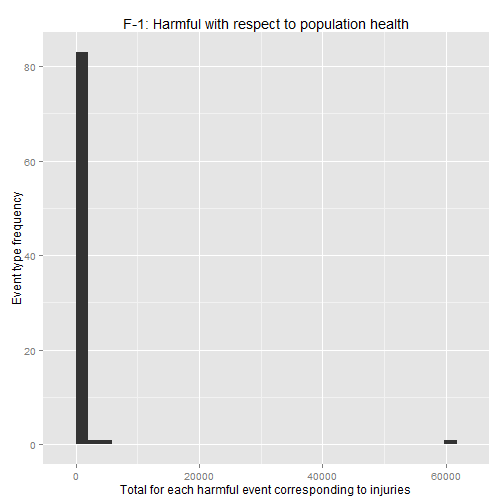
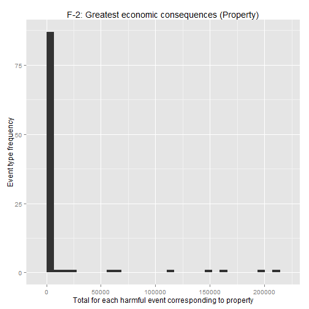
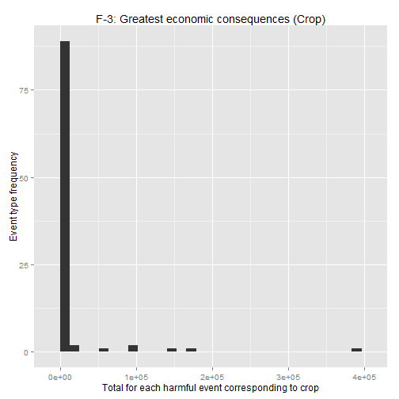

Analysis of harmful events with respect to population health and economic consequences
========================================================

Synopsis 
========
In this project we use  the NOAA Storm Database to answer two basic questoins. The weather events in the database start in the year 1950 and end in November 2011. The first goal of the project is to answer which types of events (as indicated in the EVTYPE variable) are most harmful with respect to population health.The second goal is to answer which types of events have the greatest economic consequences Across the United States. In order to answer the questions we need to subset the database which only include the required attribute of the database. And then perform a bunch of operations to end up with specific answers. The complete analysis is divided into a couple of parts such as Data Processing, Results and Figures.

Data Processing
===============

1. set up directory
2. load the data (i.e read.csv())
3. perform elementary data analysis on the data set
4. create the data frame including the required / useful columns
5. filter the data frame based on specific columns
6. check the dimension, head and summary of the data frame
7. for question #1 grouped the data using event, sum up injuries and fatalities, and sort the total injuries in decreasing order.
8. for question #2 grouped the data using event, sum up property damage and crop damage, and sort the both damage in decreasing order.
9. create new data frame (economic consequence) using property and crop damage.


```r
# setup directory
setwd("F:/Data Science/5. Reproducible Research/Week3/Project2")
getwd()
```

```
## [1] "F:/Data Science/5. Reproducible Research/Week3/Project2"
```

```r

## special note: due to slow speed of my computer, I fail to load the the
## (StromData.csv) on .Rmd file. I load the (StromData.csv) file on the R
## command line, perform the operations below (write as comments #like -
## #dim(data), #[1] 1773320 37), and reshape the data set. #Then I create two
## data frame and write them to seperate CSV file such as (dfEFI1.csv and
## dfPC1.csv) #for both #the question #1 and question #2 respectively. Next,
## I load #the both files and perform the necessary operations (uncommented r
## code on .Rmd file) to find out the #answer of the questions:

# Below are the comment out code which I run on command line:

# load the dataset

# data <- read.csv('StormData.csv', quote = '')

# dimension of the data set

# dim(data)

# [1] 1773320 37

# column names

# colnames(data)

# event types

# unique(data$X.EVTYPE.)

# subsetting the data set

# event <- data[, 8]

# fatalities <- data[, 23]

# injuries <- data[, 24]


# convert the data item

# event <- as.character(event)

# fatalities <- as.numeric(as.character(fatalities, na.rm = T))

# injuries <- as.numeric(as.character(injuries, na.rm = T))

# create the data frame

# dfEFI <- data.frame(event, fatalities, injuries)

# filter the data frame based on injuries column

# dfEFI <- dfEFI[dfEFI$injuries > 0, ]

# filter the data frame based on injuries column

# dfEFI <- dfEFI[dfEFI$fatalities > 0, ]

# dimension of the data set

# dim(dfEFI)

# [1] 873682 3

# head and summary of the data frame

# head(dfEFI)

# summary(dfEFI)

# write.csv(dfEFI, file = 'dfEFI1.csv', row.names = F)

# load the data set for question #1
dfEFI1 <- read.csv("dfEFI1.csv")
dim(dfEFI1)
```

```
## [1] 873682      3
```

```r
head(dfEFI1)
```

```
##       event fatalities injuries
## 1 "TORNADO"          1       14
## 2 "TORNADO"          1       26
## 3 "TORNADO"          4       50
## 4 "TORNADO"          1        8
## 5 "TORNADO"          6      195
## 6 "TORNADO"          7       12
```

```r

# sum up injuries grouped by event using tapply function
totalInjuries <- tapply(as.numeric(dfEFI1$injuries), as.character(dfEFI1$event), 
    sum, na.rm = T)

dim(totalInjuries)
```

```
## [1] 86
```

```r

# sort the result in decreasing order
harmfulEvent <- sort(totalInjuries, decreasing = T)

# create the data frame of the harmful events wrt population health
DFharmfulEvent <- data.frame(harmfulEvent)
dim(DFharmfulEvent)
```

```
## [1] 86  1
```

```r
summary(DFharmfulEvent)
```

```
##   harmfulEvent  
##  Min.   :    1  
##  1st Qu.:    4  
##  Median :   18  
##  Mean   :  913  
##  3rd Qu.:  130  
##  Max.   :59729
```

```r

# operation regrading to the question #2

# propertyDamage <- data[, 25]

# propertyDamageExp <- data[, 26]

# cropDamage <- data[, 27]

# cropDamageExp <- data[, 28]

# 

# event <- as.character(event)

# propertyDamage <- as.numeric(as.character(propertyDamage, na.rm = T))

# propertyDamageExp <- as.numeric(as.character(propertyDamageExp))

# cropDamage <- as.numeric(as.character(cropDamage, na.rm =T))

# cropDamageExp <- as.numeric(as.character(cropDamageExp))

# dfPC <- data.frame(event, propertyDamage, propertyDamageExp, cropDamage,
# cropDamageExp)

# dim(dfPC)

# [1] 1773320 5

# dfPC <- dfPC[dfPC$propertyDamage > 0, ]

# dfPC <- dfPC[dfPC$cropDamage > 0, ]

# dim(dfPC)

# [1] 887211 5

# write the filter out data for question #2

# write.csv(dfPC, file = 'dfPC1.csv', row.names = F)

# load the modified data for the question #2
dfPC1 <- read.csv("dfPC1.csv")
dim(dfPC1)
```

```
## [1] 887211      5
```

```r

# sum up the property damage grouped by event using tapply function
totalPropertyDamage <- tapply(as.numeric(dfPC1$propertyDamage), as.character(dfPC1$event), 
    sum, na.rm = T)

# sort the result in decreasing order
totalPropertyDamage <- sort(totalPropertyDamage, decreasing = T)

# create new data frame
totalPropertyDamage <- data.frame(totalPropertyDamage)
dim(totalPropertyDamage)
```

```
## [1] 97  1
```

```r
summary(totalPropertyDamage)
```

```
##  totalPropertyDamage
##  Min.   :     0     
##  1st Qu.:    20     
##  Median :   357     
##  Mean   : 11043     
##  3rd Qu.:  1990     
##  Max.   :207316
```

```r

# sum up the crop damage grouped by event using tapply function
totalCropDamage <- tapply(as.numeric(dfPC1$cropDamage), as.character(dfPC1$event), 
    sum, na.rm = T)

# sort the result in decreasing order
totalCropDamage <- sort(totalCropDamage, decreasing = T)

# create new data frame
totalCropDamage <- data.frame(totalCropDamage)
dim(totalCropDamage)
```

```
## [1] 97  1
```

```r
summary(totalCropDamage)
```

```
##  totalCropDamage 
##  Min.   :     0  
##  1st Qu.:    16  
##  Median :   200  
##  Mean   : 10813  
##  3rd Qu.:  1689  
##  Max.   :383718
```

```r

# create the new data frame
economicConsequences <- data.frame(totalPropertyDamage, totalCropDamage)
dim(economicConsequences)
```

```
## [1] 97  2
```

```r

# Most harmful wrt population health
head(DFharmfulEvent)
```

```
##                     harmfulEvent
## "TORNADO"                  59729
## "EXCESSIVE HEAT"            4791
## "FLOOD"                     2679
## "ICE STORM"                 1720
## "HEAT"                      1420
## "HURRICANE/TYPHOON"         1219
```

```r

# Most harmful wrt economic consequence - Property
head(totalPropertyDamage)
```

```
##                      totalPropertyDamage
## "HAIL"                            207316
## "FLASH FLOOD"                     195064
## "TORNADO"                         162682
## "FLOOD"                           145583
## "TSTM WIND"                       116950
## "THUNDERSTORM WINDS"               67681
```

```r

# Most harmful wrt economic consequence - Crop
head(totalCropDamage)
```

```
##                     totalCropDamage
## "HAIL"                       383718
## "FLASH FLOOD"                173310
## "FLOOD"                      146947
## "TSTM WIND"                   91023
## "TORNADO"                     90869
## "THUNDERSTORM WIND"           58950
```


Results
=======
1. Events which are harmful with respect to population health.
2. Events which have the greatest economic consequences


```r
# harmful wrt population health
DFharmfulEvent
```

```
##                             harmfulEvent
## "TORNADO"                          59729
## "EXCESSIVE HEAT"                    4791
## "FLOOD"                             2679
## "ICE STORM"                         1720
## "HEAT"                              1420
## "HURRICANE/TYPHOON"                 1219
## "BLIZZARD"                           718
## "LIGHTNING"                          649
## "TSTM WIND"                          646
## "FLASH FLOOD"                        641
## "WINTER STORM"                       599
## "FOG"                                308
## "HIGH WIND"                          277
## "TROPICAL STORM"                     274
## "HEAT WAVE"                          269
## "WILDFIRE"                           261
## "HEAVY SNOW"                         225
## "EXTREME COLD"                       199
## "WINTER WEATHER"                     187
## "DENSE FOG"                          157
## "WILD FIRES"                         150
## "THUNDERSTORM WIND"                  130
## "TSUNAMI"                            129
## "DUST STORM"                         106
## "RIP CURRENT"                         87
## "AVALANCHE"                           79
## "RIP CURRENTS"                        67
## "COLD"                                48
## "THUNDERSTORM WINDS"                  46
## "WINTER WEATHER/MIX"                  46
## "TROPICAL STORM GORDON"               43
## "HEAVY RAIN"                          41
## "HIGH WINDS"                          41
## "STRONG WIND"                         40
## "HIGH SURF"                           39
## "WATERSPOUT/TORNADO"                  39
## "URBAN/SML STREAM FLD"                32
## "WIND"                                29
## "LANDSLIDE"                           27
## "BLACK ICE"                           24
## "EXCESSIVE RAINFALL"                  21
## "HIGH WIND AND SEAS"                  20
## "HURRICANE"                           18
## "WINTER STORMS"                       17
## "WILD/FOREST FIRE"                    16
## "EXTREME COLD/WIND CHILL"             15
## "HEAT WAVE DROUGHT"                   15
## "WINTER STORM HIGH WINDS"             15
## "BLOWING SNOW"                        13
## "FREEZING DRIZZLE"                    13
## "HEAVY SURF/HIGH SURF"                10
## "MARINE STRONG WIND"                  10
## "TSTM WIND/HAIL"                      10
## "GLAZE"                                8
## "MARINE THUNDERSTORM WIND"             8
## "SNOW"                                 7
## "HAIL"                                 6
## "HIGH WINDS/SNOW"                      6
## "ICY ROADS"                            6
## "FLOOD/FLASH FLOOD"                    5
## "FREEZING RAIN"                        5
## "ICE"                                  5
## "MARINE MISHAP"                        5
## "ROUGH SEAS"                           5
## "FROST"                                3
## "High Surf"                            3
## "COLD/WIND CHILL"                      2
## "EXTREME WINDCHILL"                    2
## "HIGH SEAS"                            2
## "LIGHT SNOW"                           2
## "Marine Accident"                      2
## "MARINE TSTM WIND"                     2
## "RAIN/SNOW"                            2
## "STORM SURGE"                          2
## "blowing snow"                         1
## "COASTAL STORM"                        1
## "FLOODING"                             1
## "FOG AND COLD TEMPERATURES"            1
## "GUSTY WINDS"                          1
## "HEAVY SURF"                           1
## "LANDSLIDES"                           1
## "MARINE HIGH WIND"                     1
## "MIXED PRECIP"                         1
## "ROUGH SURF"                           1
## "STRONG WINDS"                         1
## "THUNDERSNOW"                          1
```

```r

# greatest economic consequences (Property and Crop)
economicConsequences
```

```
##                                 totalPropertyDamage totalCropDamage
## "HAIL"                                    207315.80       383717.90
## "FLASH FLOOD"                             195063.71       173309.74
## "TORNADO"                                 162681.92       146947.28
## "FLOOD"                                   145582.58        91023.00
## "TSTM WIND"                               116949.55        90869.06
## "THUNDERSTORM WINDS"                       67680.65        58949.85
## "THUNDERSTORM WIND"                        56037.20        17140.43
## "HIGH WIND"                                20838.33        16071.01
## "FLASH FLOODING"                           14079.00         6982.98
## "TROPICAL STORM"                            7766.87         5286.31
## "HURRICANE"                                 6518.57         5111.05
## "WILDFIRE"                                  4945.26         4748.48
## "URBAN/SML STREAM FLD"                      4750.89         4587.52
## "HEAVY RAIN"                                4396.35         3313.49
## "HURRICANE/TYPHOON"                         4167.89         3068.30
## "LIGHTNING"                                 4006.55         2860.80
## "URBAN FLOODING"                            3665.00         2658.10
## "URBAN FLOOD"                               3340.00         2260.00
## "WINTER STORM"                              3279.50         2151.82
## "WILD/FOREST FIRE"                          2785.50         2005.00
## "FLOOD/FLASH FLOOD"                         2665.80         1982.15
## "FLOODING"                                  2516.80         1825.10
## "HEAVY SNOW"                                2212.32         1794.21
## "DROUGHT"                                   2057.90         1718.55
## "TSTM WIND/HAIL"                            1990.00         1688.95
## "RIVER FLOOD"                               1907.80         1475.77
## "ICE STORM"                                 1788.85         1427.70
## "FLASH FLOODING/FLOOD"                      1750.00         1206.84
## "THUNDERSTORM WINDSS"                       1715.50          923.50
## "HIGH WINDS"                                1395.50          869.90
## "FLASH FLOOD/FLOOD"                         1276.00          850.00
## "STORM SURGE/TIDE"                          1150.00          825.00
## "HEAVY RAINS"                               1005.00          555.00
## "DUST STORM"                                 790.00          555.00
## "BLIZZARD"                                   756.50          506.75
## "TYPHOON"                                    745.00          500.00
## "HEAVY RAINS/FLOODING"                       724.00          500.00
## "HIGH WINDS/COLD"                            610.00          500.00
## "TROPICAL STORM JERRY"                       604.00          500.00
## "STRONG WIND"                                563.30          500.00
## "FLOODS"                                     500.00          500.00
## "HAIL/WINDS"                                 500.00          500.00
## "HURRICANE FELIX"                            500.00          500.00
## "SEVERE THUNDERSTORMS"                       500.00          492.40
## "TROPICAL STORM GORDON"                      500.00          475.00
## "WILDFIRES"                                  500.00          366.50
## "WINTER STORMS"                              500.00          353.00
## "TROPICAL STORM DEAN"                        400.00          218.00
## "EXTREME COLD"                               357.00          200.00
## "COASTAL FLOODING"                           325.00          175.00
## "HURRICANE ERIN"                             256.00          172.00
## "FREEZE"                                     200.00          150.00
## "HEAT WAVE DROUGHT"                          200.00          101.50
## "EXCESSIVE HEAT"                             170.00          100.00
## "HEAT WAVE"                                  160.00           59.05
## "SEVERE THUNDERSTORM WINDS"                  150.00           56.00
## "GUSTY WINDS"                                145.00           50.00
## "HEAT"                                       145.00           50.00
## "DRY MICROBURST"                             114.00           50.00
## "River Flooding"                             105.99           50.00
## "FROST/FREEZE"                                94.02           50.00
## "TSUNAMI"                                     81.00           49.00
##  across roads                                 78.00           37.00
## "HURRICANE OPAL"                              70.10           35.60
## "WINTER STORM HIGH WINDS"                     60.00           30.00
## "THUNDERSTORM WINDS HAIL"                     58.00           30.00
## "GUSTNADO"                                    51.05           29.00
## "DUST STORM/HIGH WINDS"                       50.00           20.00
## "THUDERSTORM WINDS"                           50.00           20.00
## "SMALL HAIL"                                  40.00           19.00
## "LANDSLIDE"                                   28.40           17.00
## "TORNADOES                                    25.00           16.00
## "THUNDERSTORM WINDS/HAIL"                     20.00           16.00
## "WILD/FOREST FIRES"                           20.00           14.00
## "Heavy Rain/High Surf"                        13.50           12.00
## "TORNADO F0"                                  10.20           10.00
## "THUNDERSTORM WINDS LIGHTNING"                10.00           10.00
## "THUNDERSTORM WINDS/ FLOOD"                   10.00           10.00
## "THUNDERSTORMS WIND"                          10.00           10.00
## "WIND DAMAGE"                                 10.00            9.00
## "HIGH WINDS HEAVY RAINS"                       7.50            7.20
## "FOREST FIRES"                                 5.00            5.00
## "HAIL 100"                                     5.00            5.00
## "ICE JAM FLOODING"                             5.00            5.00
## "THUNDERSTORM HAIL"                            5.00            5.00
## "THUNDERSTORMS WINDS"                          5.00            5.00
## "GLAZE ICE"                                    4.80            5.00
## "STORM SURGE"                                  1.60            5.00
## "HEAVY SNOW/HIGH WINDS & FLOOD"                1.50            5.00
##  BRADLEY AND MCMINN"                           1.00            5.00
##  WAYNE AND RUSH"                               1.00            1.60
## "Frost/Freeze"                                 1.00            1.55
## "SNOW"                                         1.00            1.50
## "HAIL/WIND"                                    0.50            1.00
## "WINDS"                                        0.50            0.80
## "HURRICANE OPAL/HIGH WINDS"                    0.10            0.05
## "COLD AIR TORNADO"                             0.05            0.05
```


Figures
=======
In X-axis of the figures represent the total damages or harms due to weather events and Y-axis represent the event frequency. That is X-axis values represent the total harms corresponding to each events (Y-axis values).

1. Figure for events which are harmful with respect to population health
2. Figure for events which have the greatest economic consequences


```r
# load the ggplot2
library(ggplot2)

# plot using qplot()
qplot(harmfulEvent, bandwidth = 2, xlab = "Total for each harmful event corresponding to injuries", 
    ylab = "Event type frequency", main = "F-1: Harmful with respect to population health")
```

```
## stat_bin: binwidth defaulted to range/30. Use 'binwidth = x' to adjust this.
```

 


- From figure F-1 it says that the total harms with respect to population health lies below 1000 for most of the event types.


```r
# load ggplot2
library(ggplot2)

# plot using qplot()
qplot(economicConsequences$totalPropertyDamage, bandwidth = 2, data = economicConsequences, 
    xlab = "Total for each harmful event corresponding to property", ylab = "Event type frequency", 
    main = "F-2: Greatest economic consequences (Property)")
```

```
## stat_bin: binwidth defaulted to range/30. Use 'binwidth = x' to adjust this.
```

 

```r

qplot(economicConsequences$totalCropDamage, bandwidth = 2, data = economicConsequences, 
    xlab = "Total for each harmful event corresponding to crop", ylab = "Event type frequency", 
    main = "F-3: Greatest economic consequences (Crop)")
```

```
## stat_bin: binwidth defaulted to range/30. Use 'binwidth = x' to adjust this.
```

 


- From figure F-2 it says that the total harms with respect to Property damage (economic consequence) lies below 1000 for most of the event types.

- From figure F-3 it says that the total harms with respect to Crop damage (economic consequence) lies below 1000 for most of the event types.

Special Note:
=============
due to slow speed of my computer, I fail to load the (StromData.csv) on .Rmd file. I load the (StromData.csv) file on the R command line, perform the operations below (write as comments like - #dim(data), #[1] 1773320      37), and reshape the data set. Then I create two data frame and write them to seperate CSV file such as  (dfEFI1.csv and dfPC1.csv) for both the question #1 and question #2 respectively. Next, I load the both files and perform the necessary operations (uncommented r code on .Rmd file) to find out the answer of the questions:
