Analysis of mtcars data set
========================================================

Load the data set

```r
data(mtcars)
mtcars0 <- mtcars[which(mtcars$am == 0), ]
mtcars1 <- mtcars[which(mtcars$am != 0), ]
plot(mtcars0$mpg)
```

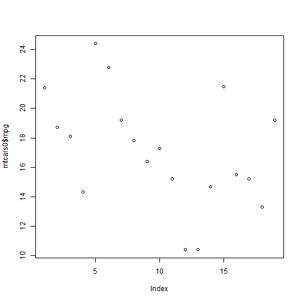 

```r
plot(mtcars1$mpg)
```

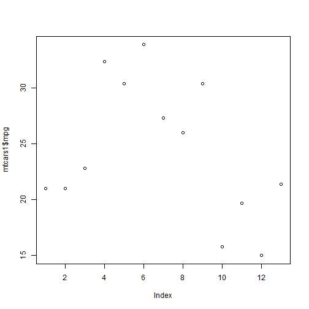 


Exploratory analysis
=====================

```r
# dimension of the data set
dim(mtcars)
```

```
## [1] 32 11
```

```r

# variables
names(mtcars)
```

```
##  [1] "mpg"  "cyl"  "disp" "hp"   "drat" "wt"   "qsec" "vs"   "am"   "gear"
## [11] "carb"
```

```r

# plot
library(lattice)
library(ggplot2)

qplot(wt, mpg, data = mtcars, col = am)
```

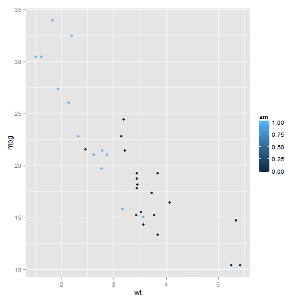 

```r

# mean of the mpg for automatic and manual transmission
meanMPG <- tapply(mtcars$mpg, mtcars$am, mean)
meanMPG
```

```
##     0     1 
## 17.15 24.39
```

```r

manual <- 24.39231
automatic <- 17.14737

meanDiff <- manual - automatic
meanDiff
```

```
## [1] 7.245
```

```r

# t test
better <- t.test(mpg ~ am, data = mtcars)
better
```

```
## 
## 	Welch Two Sample t-test
## 
## data:  mpg by am
## t = -3.767, df = 18.33, p-value = 0.001374
## alternative hypothesis: true difference in means is not equal to 0
## 95 percent confidence interval:
##  -11.28  -3.21
## sample estimates:
## mean in group 0 mean in group 1 
##           17.15           24.39
```

-Note: We can make a rough decision from the plot and meanDiff that miles per gallon (mpg) will inreases to 7.245 miles/gallon if transmission is passing from automatic (am = 0) to manual (am = 1)

Model fitting
==============

```r
model.wild <- lm(mpg ~ ., data = mtcars)
summary(model.wild)
```

```
## 
## Call:
## lm(formula = mpg ~ ., data = mtcars)
## 
## Residuals:
##    Min     1Q Median     3Q    Max 
##  -3.45  -1.60  -0.12   1.22   4.63 
## 
## Coefficients:
##             Estimate Std. Error t value Pr(>|t|)  
## (Intercept)  12.3034    18.7179    0.66    0.518  
## cyl          -0.1114     1.0450   -0.11    0.916  
## disp          0.0133     0.0179    0.75    0.463  
## hp           -0.0215     0.0218   -0.99    0.335  
## drat          0.7871     1.6354    0.48    0.635  
## wt           -3.7153     1.8944   -1.96    0.063 .
## qsec          0.8210     0.7308    1.12    0.274  
## vs            0.3178     2.1045    0.15    0.881  
## am            2.5202     2.0567    1.23    0.234  
## gear          0.6554     1.4933    0.44    0.665  
## carb         -0.1994     0.8288   -0.24    0.812  
## ---
## Signif. codes:  0 '***' 0.001 '**' 0.01 '*' 0.05 '.' 0.1 ' ' 1
## 
## Residual standard error: 2.65 on 21 degrees of freedom
## Multiple R-squared:  0.869,	Adjusted R-squared:  0.807 
## F-statistic: 13.9 on 10 and 21 DF,  p-value: 3.79e-07
```

```r


model.fit1 <- lm(mpg ~ am, data = mtcars)
summary(model.fit1)
```

```
## 
## Call:
## lm(formula = mpg ~ am, data = mtcars)
## 
## Residuals:
##    Min     1Q Median     3Q    Max 
## -9.392 -3.092 -0.297  3.244  9.508 
## 
## Coefficients:
##             Estimate Std. Error t value Pr(>|t|)    
## (Intercept)    17.15       1.12   15.25  1.1e-15 ***
## am              7.24       1.76    4.11  0.00029 ***
## ---
## Signif. codes:  0 '***' 0.001 '**' 0.01 '*' 0.05 '.' 0.1 ' ' 1
## 
## Residual standard error: 4.9 on 30 degrees of freedom
## Multiple R-squared:  0.36,	Adjusted R-squared:  0.338 
## F-statistic: 16.9 on 1 and 30 DF,  p-value: 0.000285
```

```r
resid(model.fit1)
```

```
##           Mazda RX4       Mazda RX4 Wag          Datsun 710 
##             -3.3923             -3.3923             -1.5923 
##      Hornet 4 Drive   Hornet Sportabout             Valiant 
##              4.2526              1.5526              0.9526 
##          Duster 360           Merc 240D            Merc 230 
##             -2.8474              7.2526              5.6526 
##            Merc 280           Merc 280C          Merc 450SE 
##              2.0526              0.6526             -0.7474 
##          Merc 450SL         Merc 450SLC  Cadillac Fleetwood 
##              0.1526             -1.9474             -6.7474 
## Lincoln Continental   Chrysler Imperial            Fiat 128 
##             -6.7474             -2.4474              8.0077 
##         Honda Civic      Toyota Corolla       Toyota Corona 
##              6.0077              9.5077              4.3526 
##    Dodge Challenger         AMC Javelin          Camaro Z28 
##             -1.6474             -1.9474             -3.8474 
##    Pontiac Firebird           Fiat X1-9       Porsche 914-2 
##              2.0526              2.9077              1.6077 
##        Lotus Europa      Ford Pantera L        Ferrari Dino 
##              6.0077             -8.5923             -4.6923 
##       Maserati Bora          Volvo 142E 
##             -9.3923             -2.9923
```

```r

res <- residuals(model.fit1)
fitted <- fitted(model.fit1)
res
```

```
##           Mazda RX4       Mazda RX4 Wag          Datsun 710 
##             -3.3923             -3.3923             -1.5923 
##      Hornet 4 Drive   Hornet Sportabout             Valiant 
##              4.2526              1.5526              0.9526 
##          Duster 360           Merc 240D            Merc 230 
##             -2.8474              7.2526              5.6526 
##            Merc 280           Merc 280C          Merc 450SE 
##              2.0526              0.6526             -0.7474 
##          Merc 450SL         Merc 450SLC  Cadillac Fleetwood 
##              0.1526             -1.9474             -6.7474 
## Lincoln Continental   Chrysler Imperial            Fiat 128 
##             -6.7474             -2.4474              8.0077 
##         Honda Civic      Toyota Corolla       Toyota Corona 
##              6.0077              9.5077              4.3526 
##    Dodge Challenger         AMC Javelin          Camaro Z28 
##             -1.6474             -1.9474             -3.8474 
##    Pontiac Firebird           Fiat X1-9       Porsche 914-2 
##              2.0526              2.9077              1.6077 
##        Lotus Europa      Ford Pantera L        Ferrari Dino 
##              6.0077             -8.5923             -4.6923 
##       Maserati Bora          Volvo 142E 
##             -9.3923             -2.9923
```

```r
fitted
```

```
##           Mazda RX4       Mazda RX4 Wag          Datsun 710 
##               24.39               24.39               24.39 
##      Hornet 4 Drive   Hornet Sportabout             Valiant 
##               17.15               17.15               17.15 
##          Duster 360           Merc 240D            Merc 230 
##               17.15               17.15               17.15 
##            Merc 280           Merc 280C          Merc 450SE 
##               17.15               17.15               17.15 
##          Merc 450SL         Merc 450SLC  Cadillac Fleetwood 
##               17.15               17.15               17.15 
## Lincoln Continental   Chrysler Imperial            Fiat 128 
##               17.15               17.15               24.39 
##         Honda Civic      Toyota Corolla       Toyota Corona 
##               24.39               24.39               17.15 
##    Dodge Challenger         AMC Javelin          Camaro Z28 
##               17.15               17.15               17.15 
##    Pontiac Firebird           Fiat X1-9       Porsche 914-2 
##               17.15               24.39               24.39 
##        Lotus Europa      Ford Pantera L        Ferrari Dino 
##               24.39               24.39               24.39 
##       Maserati Bora          Volvo 142E 
##               24.39               24.39
```

```r
hist(fitted)
```

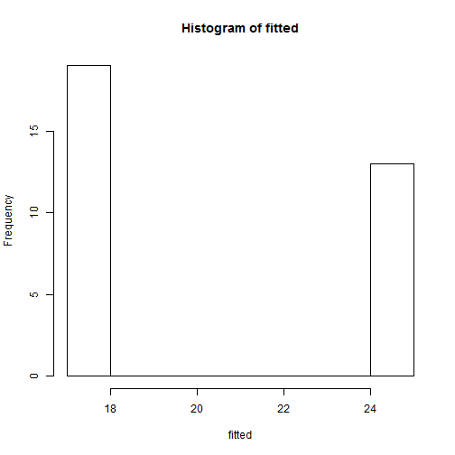 

```r
hist(res)
```

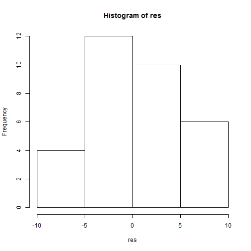 

```r
plot(fitted, res)
confint.lm(model.fit1)
```

```
##              2.5 % 97.5 %
## (Intercept) 14.851  19.44
## am           3.642  10.85
```

```r
confint(model.fit1)
```

```
##              2.5 % 97.5 %
## (Intercept) 14.851  19.44
## am           3.642  10.85
```

```r
abline(h = 0, lty = 2)
```

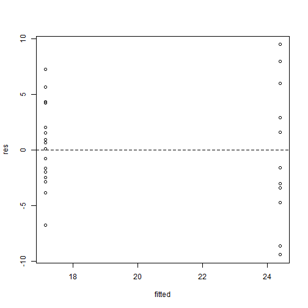 

```r
abline(plot(model.fit1), lwd = 2)
```

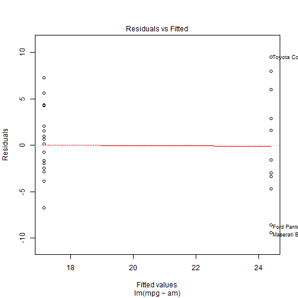 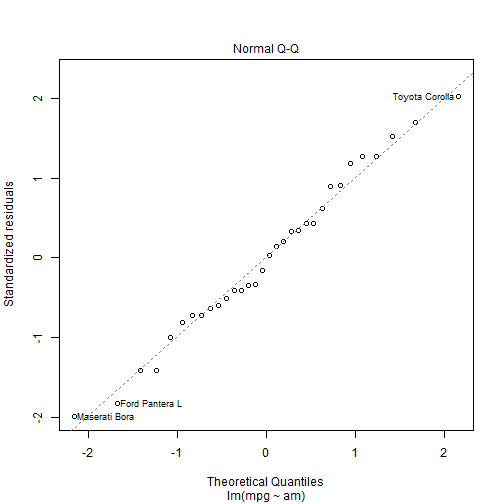 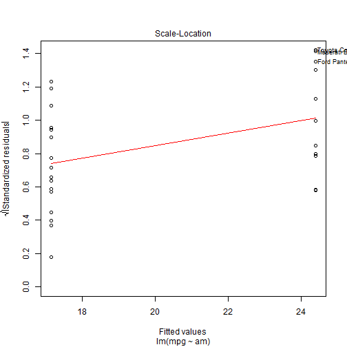 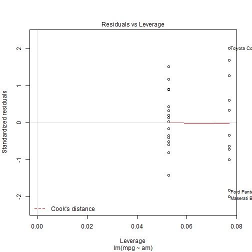 

```r
# model selection using backward elimination
backElim <- step(model.wild, , direction = "backward")
```

```
## Start:  AIC=70.9
## mpg ~ cyl + disp + hp + drat + wt + qsec + vs + am + gear + carb
## 
##        Df Sum of Sq RSS  AIC
## - cyl   1      0.08 148 68.9
## - vs    1      0.16 148 68.9
## - carb  1      0.41 148 69.0
## - gear  1      1.35 149 69.2
## - drat  1      1.63 149 69.2
## - disp  1      3.92 151 69.7
## - hp    1      6.84 154 70.3
## - qsec  1      8.86 156 70.8
## <none>              148 70.9
## - am    1     10.55 158 71.1
## - wt    1     27.01 174 74.3
## 
## Step:  AIC=68.92
## mpg ~ disp + hp + drat + wt + qsec + vs + am + gear + carb
## 
##        Df Sum of Sq RSS  AIC
## - vs    1      0.27 148 67.0
## - carb  1      0.52 148 67.0
## - gear  1      1.82 149 67.3
## - drat  1      1.98 150 67.3
## - disp  1      3.90 152 67.7
## - hp    1      7.36 155 68.5
## <none>              148 68.9
## - qsec  1     10.09 158 69.0
## - am    1     11.84 159 69.4
## - wt    1     27.03 175 72.3
## 
## Step:  AIC=66.97
## mpg ~ disp + hp + drat + wt + qsec + am + gear + carb
## 
##        Df Sum of Sq RSS  AIC
## - carb  1      0.69 148 65.1
## - gear  1      2.14 150 65.4
## - drat  1      2.21 150 65.4
## - disp  1      3.65 152 65.8
## - hp    1      7.11 155 66.5
## <none>              148 67.0
## - am    1     11.57 159 67.4
## - qsec  1     15.68 164 68.2
## - wt    1     27.38 175 70.4
## 
## Step:  AIC=65.12
## mpg ~ disp + hp + drat + wt + qsec + am + gear
## 
##        Df Sum of Sq RSS  AIC
## - gear  1       1.6 150 63.5
## - drat  1       1.9 150 63.5
## <none>              148 65.1
## - disp  1      10.1 159 65.2
## - am    1      12.3 161 65.7
## - hp    1      14.8 163 66.2
## - qsec  1      26.4 175 68.4
## - wt    1      69.1 218 75.3
## 
## Step:  AIC=63.46
## mpg ~ disp + hp + drat + wt + qsec + am
## 
##        Df Sum of Sq RSS  AIC
## - drat  1       3.3 153 62.2
## - disp  1       8.5 159 63.2
## <none>              150 63.5
## - hp    1      13.3 163 64.2
## - am    1      20.0 170 65.5
## - qsec  1      25.6 176 66.5
## - wt    1      67.6 218 73.4
## 
## Step:  AIC=62.16
## mpg ~ disp + hp + wt + qsec + am
## 
##        Df Sum of Sq RSS  AIC
## - disp  1       6.6 160 61.5
## <none>              153 62.2
## - hp    1      12.6 166 62.7
## - qsec  1      26.5 180 65.3
## - am    1      32.2 186 66.3
## - wt    1      69.0 222 72.1
## 
## Step:  AIC=61.52
## mpg ~ hp + wt + qsec + am
## 
##        Df Sum of Sq RSS  AIC
## - hp    1       9.2 169 61.3
## <none>              160 61.5
## - qsec  1      20.2 180 63.3
## - am    1      26.0 186 64.3
## - wt    1      78.5 239 72.3
## 
## Step:  AIC=61.31
## mpg ~ wt + qsec + am
## 
##        Df Sum of Sq RSS  AIC
## <none>              169 61.3
## - am    1      26.2 195 63.9
## - qsec  1     109.0 278 75.2
## - wt    1     183.3 353 82.8
```

```r
backElim
```

```
## 
## Call:
## lm(formula = mpg ~ wt + qsec + am, data = mtcars)
## 
## Coefficients:
## (Intercept)           wt         qsec           am  
##        9.62        -3.92         1.23         2.94
```

```r
summary(backElim)$coef
```

```
##             Estimate Std. Error t value  Pr(>|t|)
## (Intercept)    9.618     6.9596   1.382 1.779e-01
## wt            -3.917     0.7112  -5.507 6.953e-06
## qsec           1.226     0.2887   4.247 2.162e-04
## am             2.936     1.4109   2.081 4.672e-02
```

```r
plot(backElim)
```

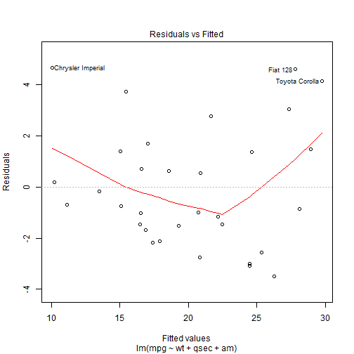  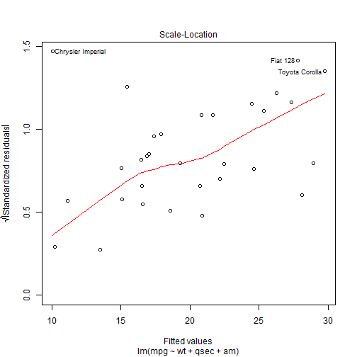 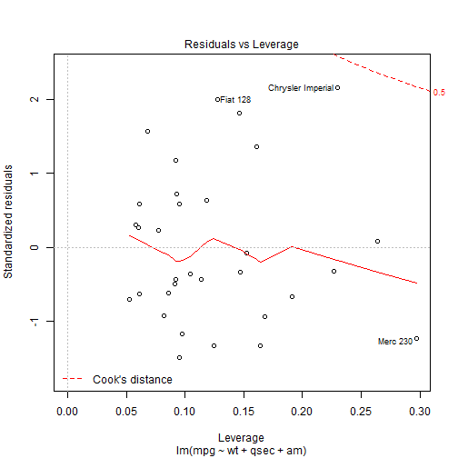 

```r

model.fit <- lm(mpg ~ wt + qsec + am, data = mtcars)

summary(model.fit)$coef
```

```
##             Estimate Std. Error t value  Pr(>|t|)
## (Intercept)    9.618     6.9596   1.382 1.779e-01
## wt            -3.917     0.7112  -5.507 6.953e-06
## qsec           1.226     0.2887   4.247 2.162e-04
## am             2.936     1.4109   2.081 4.672e-02
```


Results
=======
- Manual transmission is better than automatic transmission for MPG.
