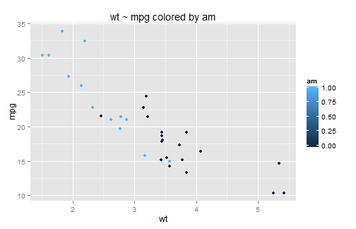
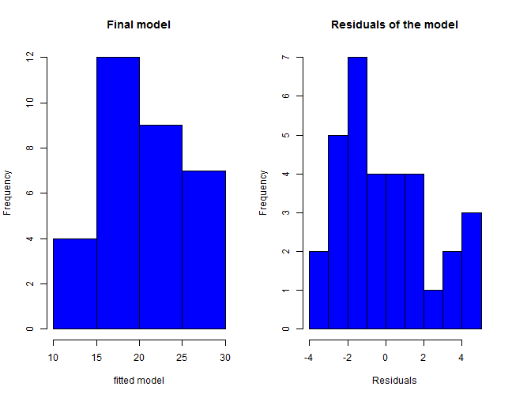
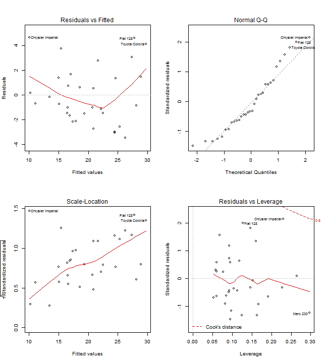

Regression Models Project
=========================

Synopsis 
========
The purpose of this project is to find out which transmission is better for miles per gallon, and quantify the difference of the mpg between automatic and manual transmissions.

Data processing
===============

Exploratory data analysis
=========================

- Load the data and perform exploratory data analysis.

```r
data(mtcars)
dim(mtcars)
names(mtcars)

# plot
library(lattice)
mpg.wt.am <- qplot(wt, mpg, data = mtcars, col = am, main = "wt ~ mpg colored by am")

# mean of the mpg for automatic and manual transmission
meanMPG <- tapply(mtcars$mpg, mtcars$am, mean)
manual <- 24.39231
automatic <- 17.14737
meanDiff <- manual - automatic

# t test
test <- t.test(mpg ~ am, data = mtcars)
test
```


A primary / rough decision can be made from the plot, difference of mean, and t.test that miles per gallon (mpg) will inreases to 7.245 miles/gallon if transmission is passing from automatic (am = 0) to manual (am = 1)

Fit multiple model
==================

Fit multiple linear regression models and select the model using  backward elimination.

```r
# fit a model using mpg as outcome and am as predictor
model.mpg.am <- lm(mpg ~ am, data = mtcars)

# fit a model using mpg as outcome and all other variables as predictors.
model.wild <- lm(mpg ~ ., data = mtcars)
summary(model.wild)
# model selection using backward elimination
backElim <- step(model.wild, , direction = "backward")
summ.coef <- summary(backElim)$coef

# fit the final model
model.fit <- lm(mpg ~ wt + qsec + am, data = mtcars)
summary(model.fit)
```


Residual diagnostics
====================

plot the residuals of the model (see Supporting appendix part) and perform some diagnostics

```r
res <- resid(model.fit)
fit <- fitted(model.fit)
```


Uncertainty ~ Inference
=======================

Confidence interval of the model

```r
conInt <- confint(model.fit)
```


Results / summary
=================


- Confidence interval:

```
##                2.5 % 97.5 %
## (Intercept) -4.63830 23.874
## wt          -5.37333 -2.460
## qsec         0.63457  1.817
## am           0.04573  5.826
```


- Coefficients of the fitted model

```
##             Estimate Std. Error t value  Pr(>|t|)
## (Intercept)    9.618     6.9596   1.382 1.779e-01
## wt            -3.917     0.7112  -5.507 6.953e-06
## qsec           1.226     0.2887   4.247 2.162e-04
## am             2.936     1.4109   2.081 4.672e-02
```


- Multiple R-squared:  0.85
- Manual transmission is better than automatic transmission for MPG.

Supporting appendix
===================
- plot mtcars data

 


- plot the histogram of the fitted model and residuals of the model

 


- plot the model selection using backward elimination

 


