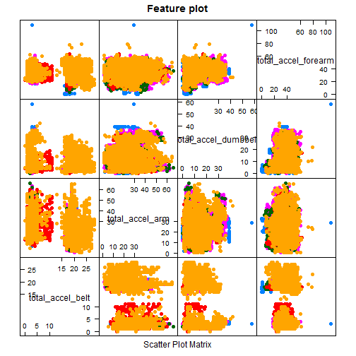
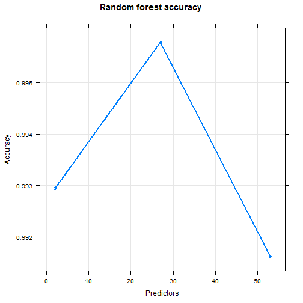

Qualitative Activity Recognition
================================

Synopsis 
========
The goal of your project is to predict the manner. The training data for this project are pml-training.csv available here:  https://d396qusza40orc.cloudfront.net/predmachlearn/pml-training.csv and the test data are 
pml-testing.csv available here: https://d396qusza40orc.cloudfront.net/predmachlearn/pml-testing.csv. The data for this project come from this source: http://groupware.les.inf.puc-rio.br/har.

Data Preprocessing
==================
1. Set up the working directory.

2. Load the training and testing data, and perform elementary data analysis.

3. Preprocess the data, and extract the useful feature. For this purpose, select the columns which have most of the entry are NA and blank, and filter out the training and test data set and build the validate data set that use to train the model.At this phase, perform the elementary data analysis on newly build training data set.

4. For implementing Machine Learning algorithm load the "caret" package.

5. Partition the tidy training data using "createDataPartition()" function and perform basic operations.

6. Now find out the less useful or useless predictor from the tidy training data set, and update the training data set.

7. Fit a model on the training data set i.e apply "train()" function where method is random forest algorithm (mehtod = "rf"). In order to speed up the execution trControl parameter of the "train" function is used.

8. Print the fitted model and check out the accuracy of the model.

9. Predict the classe of each instance of the reshaped test data set by using "prediction" function of the caret package.

10. estimate out of sample error appropriately with cross-validation

11. write up the predicted character vector to the ".txt" files


```r
# setup directory
setwd("F:/Data Science/8. Pratical Machine Learning/Week3/Assessment/Project")
getwd()
```

```
## [1] "F:/Data Science/8. Pratical Machine Learning/Week3/Assessment/Project"
```


Load the data set and check the dimension

```r
# load the data set and check the dimension
trainRawData <- read.csv("pml-training.csv", na.strings = c("NA", ""))
dim(trainRawData)
```

```
## [1] 19622   160
```


To eliminate the columns where most of the entry are NA values find out the NAs, build a new data set , and check out the dimension.

```r
# discard NA
NAs2 <- apply(trainRawData, 2, function(x) {
    sum(is.na(x))
})

# build new training data set
validData2 <- trainRawData[, which(NAs2 == 0)]
dim(validData2)
```

```
## [1] 19622    60
```


Load the "caret" package, partition the training data set, get the training data, and check the dimension and View the data set.

```r
# make trianing set
library(caret)
training <- createDataPartition(y = validData2$classe, p = 0.7, list = FALSE)
trainData <- validData2[training, ]
dim(trainData)
```

```
## [1] 13737    60
```

```r

testValidateData <- validData2[-training, ]
dim(testValidateData)
```

```
## [1] 5885   60
```


Take a manual look up over the data set and discard the useless predictors. Then, we are ready to use the training data to train the model.

```r
# discard useless predictors
removeIndex <- grep("timestamp|X|user_name|new_window", names(trainData))

trainingData <- trainData[, -removeIndex]
dim(trainingData)
```

```
## [1] 13737    54
```

```r

testValidateData <- testValidateData[, -removeIndex]
dim(testValidateData)
```

```
## [1] 5885   54
```

```r

# plot features
total <- which(grepl("^total", colnames(trainingData), ignore.case = F))

totalAccel <- trainingData[, total]

featurePlot(x = totalAccel, y = trainingData$classe, pch = 19, main = "Feature plot", 
    plot = "pairs")
```

 


Build the prediction model using the training data where "classe" is the outcome and other features are as predictors, method is random forest ("rf"), and the remaining parameter is "trControl".

```r
# train control
trControl <- trainControl(method = "cv", number = 4)

# build model
modelFit.rf <- train(trainingData$classe ~ ., method = "rf", trControl = trControl, 
    trainingData)

summary(modelFit.rf)
```

```
##                 Length Class      Mode     
## call                4  -none-     call     
## type                1  -none-     character
## predicted       13737  factor     numeric  
## err.rate         3000  -none-     numeric  
## confusion          30  -none-     numeric  
## votes           68685  matrix     numeric  
## oob.times       13737  -none-     numeric  
## classes             5  -none-     character
## importance         53  -none-     numeric  
## importanceSD        0  -none-     NULL     
## localImportance     0  -none-     NULL     
## proximity           0  -none-     NULL     
## ntree               1  -none-     numeric  
## mtry                1  -none-     numeric  
## forest             14  -none-     list     
## y               13737  factor     numeric  
## test                0  -none-     NULL     
## inbag               0  -none-     NULL     
## xNames             53  -none-     character
## problemType         1  -none-     character
## tuneValue           1  data.frame list     
## obsLevels           5  -none-     character
```

```r
modelFit.rf$finalModel
```

```
## 
## Call:
##  randomForest(x = x, y = y, mtry = param$mtry) 
##                Type of random forest: classification
##                      Number of trees: 500
## No. of variables tried at each split: 27
## 
##         OOB estimate of  error rate: 0.27%
## Confusion matrix:
##      A    B    C    D    E class.error
## A 3905    0    0    0    1    0.000256
## B   10 2645    3    0    0    0.004891
## C    0    5 2390    1    0    0.002504
## D    0    0    9 2242    1    0.004440
## E    0    1    0    6 2518    0.002772
```


Reshape the test data set i.e discarding the column with where most of the entry are NA and useless predictors.

```r
# load the testing data set
testRawData <- read.csv("pml-testing.csv", na.strings = c("NA", ""))
dim(testRawData)
```

```
## [1]  20 160
```

```r

# discard NA
NAs <- apply(testRawData, 2, function(x) {
    sum(is.na(x))
})

validDataT <- testRawData[, which(NAs == 0)]
dim(validDataT)
```

```
## [1] 20 60
```

```r

# discard useless predictors
removeIndex <- grep("timestamp|X|user_name|new_window", names(validDataT))

testData <- validDataT[, -removeIndex]
dim(testData)
```

```
## [1] 20 54
```


Apply the machine learning model to the test data set, and get the predictions.

```r
model.predict <- predict(modelFit.rf, testData)
model.predict
```

```
##  [1] B A B A A E D B A A B C B A E E A B B B
## Levels: A B C D E
```

```r
summary(model.predict)
```

```
## A B C D E 
## 7 8 1 1 3
```

```r
# create a character vector of the predictions and check #the length of the
# vector
model.predict <- c(as.character(model.predict))
# length of the predicted vector
length(model.predict)
```

```
## [1] 20
```

```r
model.predict
```

```
##  [1] "B" "A" "B" "A" "A" "E" "D" "B" "A" "A" "B" "C" "B" "A" "E" "E" "A"
## [18] "B" "B" "B"
```


Results
=======
Designed machine learning algorithm:

```r
library(caret)
# Result of the random forest model
print(modelFit.rf, digits = 3)
```

```
## Random Forest 
## 
## 13737 samples
##    53 predictors
##     5 classes: 'A', 'B', 'C', 'D', 'E' 
## 
## No pre-processing
## Resampling: Cross-Validated (4 fold) 
## 
## Summary of sample sizes: 10302, 10303, 10303, 10303 
## 
## Resampling results across tuning parameters:
## 
##   mtry  Accuracy  Kappa  Accuracy SD  Kappa SD
##   2     0.993     0.991  0.00145      0.00184 
##   27    0.996     0.995  0.000733     0.000928
##   53    0.992     0.989  0.00297      0.00376 
## 
## Accuracy was used to select the optimal model using  the largest value.
## The final value used for the model was mtry = 27.
```

```r

# plot the random forest model
plot(modelFit.rf, log = "y", lwd = 2, main = "Random forest accuracy", xlab = "Predictors", 
    ylab = "Accuracy")
```

 


Predictions:

```r
# Result of the prediction
library(caret)
model.predict
```

```
##  [1] "B" "A" "B" "A" "A" "E" "D" "B" "A" "A" "B" "C" "B" "A" "E" "E" "A"
## [18] "B" "B" "B"
```


Out of sample error
===================

In sample error rate is 0.4% (1 - 1-.996 = 0.004 * 100).

Estimate out of sample error 

```r
dim(testValidateData)
```

```
## [1] 5885   54
```

```r

# predict on testValidateData
predictions <- predict(modelFit.rf, testValidateData)
# length of the predictions
length(predictions)
```

```
## [1] 5885
```

```r

# true accuracy of the predicted model
outOfSampleError.accuracy <- sum(predictions == testValidateData$classe)/length(predictions)

outOfSampleError.accuracy
```

```
## [1] 0.9864
```

```r

# out of sample error and percentage of out of sample error
outOfSampleError <- 1 - outOfSampleError.accuracy
outOfSampleError
```

```
## [1] 0.01359
```

```r
e <- outOfSampleError * 100
paste0("Out of sample error estimation: ", round(e, digits = 2), "%")
```

```
## [1] "Out of sample error estimation: 1.36%"
```


Write up
========

Write up the predicted character to the ".txt" files

```r
# write up
pml_write_files = function(x) {
    n = length(x)
    for (i in 1:n) {
        filename = paste0("problem_id_", i, ".txt")
        write.table(x[i], file = filename, quote = FALSE, row.names = FALSE, 
            col.names = FALSE)
    }
}

pml_write_files(model.predict)
```

